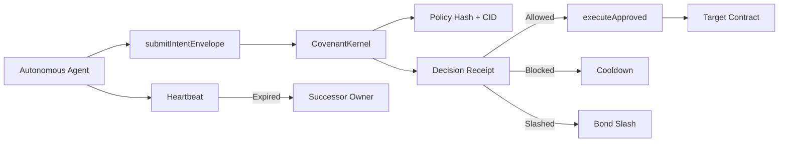

# Ritual Covenant

**A live on-chain policy firewall for autonomous agents on Ritual Chain Testnet.**

Ritual Covenant is not another dashboard that watches agents after the damage is done. It is a pre-execution control layer: an agent submits an intent, the kernel records a policy decision, bonded value is enforced, and approved execution becomes a public receipt.


## Live Proof

| Item | Value |
| --- | --- |
| Network | Ritual Chain Testnet |
| Chain ID | `1979` |
| Contract | [`0x4086710799f9d1Cb1eDb4D0a64522F00A5790270`](https://explorer.ritualfoundation.org/address/0x4086710799f9d1Cb1eDb4D0a64522F00A5790270) |
| Deployment tx | [`0xdd17daee2f10ec9489898b5ff3660cdfd11942223c2a167d99f404b09322cd30`](https://explorer.ritualfoundation.org/tx/0xdd17daee2f10ec9489898b5ff3660cdfd11942223c2a167d99f404b09322cd30) |
| Guardian Agent | [`0xC5804673c09e0b492bc2371892c8c0270ef0878E`](https://explorer.ritualfoundation.org/address/0xC5804673c09e0b492bc2371892c8c0270ef0878E) |
| Guardian deploy tx | [`0x89d11d69c2171f87c2a2051fbc0785cc7e71ce1a6857988d8ba558cdcabc75b5`](https://explorer.ritualfoundation.org/tx/0x89d11d69c2171f87c2a2051fbc0785cc7e71ce1a6857988d8ba558cdcabc75b5) |
| Guardian live flow tx | [`0x602de1ae86a26601388bd3c19a2ad222e420c1fa7fbd3affe52de31aa59019b9`](https://explorer.ritualfoundation.org/tx/0x602de1ae86a26601388bd3c19a2ad222e420c1fa7fbd3affe52de31aa59019b9) |
| Commit-Reveal Bounty Judge | [`0xf25720F49d877F4CAD539C6Bf0d2851B5e3Cb809`](https://explorer.ritualfoundation.org/address/0xf25720F49d877F4CAD539C6Bf0d2851B5e3Cb809) |
| Bounty Judge deploy tx | [`0x6ee694e8fdeecd64759034a130caec0b321381a4df73ebbd782fad4ab843b95f`](https://explorer.ritualfoundation.org/tx/0x6ee694e8fdeecd64759034a130caec0b321381a4df73ebbd782fad4ab843b95f) |
| Live execution tx | [`0xc2cfd5ee8d7e0106dd9a3067423731979e8f9c4b907b5f1e5a0762f1877e05fa`](https://explorer.ritualfoundation.org/tx/0xc2cfd5ee8d7e0106dd9a3067423731979e8f9c4b907b5f1e5a0762f1877e05fa) |
| Live agent | `agent #1` |
| Live check | `check #1` |
| Guardian live agent | `agent #2` |
| Guardian live check | `check #2` |
| Execution value | `0.005 RITUAL` |
| Guardian execution value | `0.001 RITUAL` |
| Remaining agent bond | `0.045 RITUAL` |
| Remaining Guardian bond | `0.019 RITUAL` |

The frontend reads directly from Ritual RPC. It calls `agents(1)`, `intents(1)`, `receipts(1)`, transaction receipts, and `RitualValueSink.received()`. If RPC is unavailable, the UI shows an RPC state instead of falling back to fake data.

## What It Does

Ritual Covenant gives autonomous agents an enforceable operating boundary:

- **Agent registry:** binds an agent owner, successor, policy hash, policy CID, memory CID, heartbeat rule, and bonded value.
- **Intent firewall:** stores a proposed action before value, authority, or secrets move.
- **Decision receipts:** records `Allowed`, `Blocked`, `Slashed`, or inherited decisions as machine-readable hashes.
- **Bond enforcement:** approved execution debits only the registered agent's own bond.
- **Slashing path:** attestors can freeze and slash an agent that violates policy.
- **Machine inheritance:** missed heartbeat conditions can transfer control to a registered successor.
- **EIP-712 registration:** agents can sign policy registration off-chain through `registerAgentSigned`.

## Why This Is Different

Most agent safety tools are monitoring layers, chat-based judges, or post-incident review systems. Ritual Covenant is different because it sits before execution:

| Common approach | Limitation | Ritual Covenant |
| --- | --- | --- |
| Agent dashboard | Read-only telemetry | Contract-enforced decisions and receipts |
| AI judge | Subjective after-the-fact dispute | Pre-execution policy gate |
| Dead-man switch | Human estate recovery | Agent memory, bond, and successor recovery |
| Escrow task bot | Single-purpose payment flow | General agent policy kernel |

## Architecture



## Smart Contract

Main contracts:

```text
contracts/CovenantKernel.sol          live policy kernel
contracts/CovenantGuardianAgent.sol   tested companion agent contract
contracts/CommitRevealBountyJudge.sol privacy-preserving bounty judge module
```

Core external surface:

```solidity
registerAgent(address agent, bytes32 policyHash, string cid, address successor)
submitIntent(uint256 agentId, bytes calldata intent, uint256 value)
submitIntentEnvelope(uint256 agentId, address target, uint256 value, bytes calldata callData, uint64 ttl)
recordDecision(uint256 checkId, uint8 decision, string reasonCid)
executeApproved(uint256 checkId, bytes calldata callData)
slash(uint256 agentId, uint256 amount, address beneficiary)
executeWill(uint256 agentId, string newMemoryCid)
registerAgentSigned(...)
```

Important implementation notes:

- Self-contained Solidity `0.8.24+`.
- No OpenZeppelin imports.
- Direct ETH transfers revert. Value enters through `registerAgent` or `fundAgent`.
- `executeApproved` requires an `Allowed` receipt and exact calldata hash match.
- A submitted intent can only execute once.
- Execution value is debited from that agent's bond, not from other agents.
- Ritual testnet millisecond-style timestamps are normalized inside the contract.

`CovenantGuardianAgent` is deployed on Ritual Chain Testnet and extends the kernel into an agent-facing runtime:

- The Guardian contract can register itself as the owner of a `CovenantKernel` agent.
- Any keeper can pulse the Guardian heartbeat without gaining policy control.
- The operator can submit guarded intents through the Guardian-owned kernel agent.
- `previewDecision` scores a kernel intent from on-chain facts before gas is spent on the final receipt.
- If the kernel owner trusts the Guardian as an attestor, `watchKernelIntent` records `Allowed`, `Blocked`, or `Slashed` decisions directly in `CovenantKernel`.
- `executeGuardianApproved` executes only after the kernel stores an `Allowed` receipt.

The live Guardian flow was executed on Ritual Chain Testnet: the Guardian was trusted as a kernel attestor, allowlisted the live sink target, registered itself as kernel agent `#2`, submitted check `#2`, recorded an `Allowed` receipt, and executed `0.001 RITUAL` through the kernel.

## Privacy-Preserving AI Bounty Judge

The repository now includes an assignment-ready commit-reveal module that extends the Covenant idea into fair bounty judging. It does not replace `CovenantKernel`; it adds a focused bounty surface where participants hide answers during the submission phase and reveal them only after copying is no longer useful.

Live deployment:

```text
CommitRevealBountyJudge: 0xf25720F49d877F4CAD539C6Bf0d2851B5e3Cb809
Deploy tx: 0x6ee694e8fdeecd64759034a130caec0b321381a4df73ebbd782fad4ab843b95f
Gas used: 1,489,250
Owner / initial judge: 0xf6d02F13D7BB5fC24aB6A3D662619641958A3Cf6
```

Required contract functions:

```solidity
submitCommitment(uint256 bountyId, bytes32 commitment)
revealAnswer(uint256 bountyId, string calldata answer, bytes32 salt)
judgeAll(uint256 bountyId, bytes calldata llmInput)
finalizeWinner(uint256 bountyId, uint256 winnerIndex)
```

Lifecycle:

1. A bounty creator opens a bounty with a prompt CID, prompt hash, commit deadline, and reveal deadline.
2. Participants submit only `bytes32 commitment`.
3. After the commit deadline, participants reveal `answer` and `salt`.
4. The contract checks `keccak256(abi.encode(answer, salt, msg.sender, bountyId))`.
5. Only valid revealed submissions become eligible for judging.
6. `judgeAll` anchors one canonical batch LLM input hash for all eligible answers.
7. `finalizeWinner` selects a winner from the eligible revealed set.

Test plan:

- reject empty commitments
- reject duplicate commitments
- reject early reveals
- reject late commitments
- reject reveals without prior commitments
- reject wrong salt or copied answer
- accept valid reveals after the commit deadline
- track eligible revealed submission IDs
- reject judging before the reveal deadline
- restrict judging to the bounty creator or trusted judge
- anchor a single batch LLM input hash
- reject invalid winner index and double finalization

Ritual-native hidden submission architecture:

- The required commit-reveal track stores commitments on-chain and reveals plaintext on-chain after the commit phase.
- The advanced Ritual path keeps encrypted answers off-chain or in encrypted calldata/storage until a TEE-backed Ritual job receives the batch.
- Plaintext should exist only in the participant client before submission and inside the TEE-backed batch judge during scoring.
- On-chain storage should hold bounty metadata, commitments, reveal eligibility, ciphertext hashes, batch input hash, result hash, and final winner.
- Off-chain storage can hold encrypted answer blobs by CID.
- The LLM should receive one batch containing the prompt, all eligible encrypted submissions after decryption, scoring rubric, and participant IDs, not one call per answer.

Reflection: what should be public, hidden, AI-decided, or human-decided?

The bounty rules, deadlines, commitment hashes, reveal validity, judge receipt, and final winner should be public so anyone can audit the process. Answers should stay hidden during the submission phase because public answers create an unfair copying race. In the basic commit-reveal version, answers become public during reveal so the community can verify eligibility. In a stronger Ritual-native version, plaintext answers should stay inside a TEE-backed batch judge until the judging result is ready. AI should score submissions against the published rubric and produce a ranked recommendation. Humans should decide whether the rubric is fair, whether the bounty should be cancelled for abuse, and whether edge cases need review. The contract should enforce deadlines, eligibility, and finalization so neither AI nor humans can quietly change the rules after participants submit.

## Frontend

The app is a production control surface with live Ritual RPC reads for the dashboard, contract page, agent page, and receipt proof.

Key files:

```text
src/App.tsx
src/lib/onchain.ts
src/lib/contracts.ts
src/components/CovenantScene.tsx
```

Visual direction:

- Ritual-inspired hand-drawn science fiction layer.
- Live receipt console with explorer links.
- Agent state cards sourced from contract storage.
- Contract proof panel sourced from Ritual RPC.
- Interactive bounty attack replay comparing a public answer leak against the commit-reveal gate.
- Bounty receipt rail and developer helper cards that show how another builder can integrate the module.
- Responsive layout tested on desktop and mobile viewport sizes.

## Run Locally

Install and build:

```bash
npm install
npm run build
npm run serve
```

Open:

```text
http://127.0.0.1:5177/
```

For development:

```bash
npm run dev
```

## Verification

Compile the contract:

```bash
npm run contract:compile
```

Run local contract tests:

```bash
npm run contract:test
```

Run only the Guardian agent suite:

```bash
npm run contract:guardian:test
```

Run only the commit-reveal bounty suite:

```bash
npm run contract:bounty:test
```

Deploy only the commit-reveal bounty contract:

```bash
set DRY_RUN=true&& npm run contract:deploy:bounty
set DRY_RUN=false&& npm run contract:deploy:bounty
```

Estimate gas:

```bash
npm run contract:gas
```

Guardian gas from local chain simulation:

| Flow | Gas |
| --- | ---: |
| Deploy `CovenantGuardianAgent` | `2,684,461` |
| Full Guardian flow | `3,667,618` |

Dry-run Guardian deployment before spending fees:

```bash
set DRY_RUN=true&& npm run contract:deploy:guardian
```

Run the live Ritual flow:

```bash
npm run contract:live
```

Run the live Guardian flow:

```bash
npm run contract:guardian:live
```

Build the frontend:

```bash
npm run build
```

Current verification status:

- Contract compile: pass
- Contract tests: pass
- Commit-reveal bounty tests: pass
- Commit-reveal bounty deploy: pass
- Gas estimate: pass
- Live Ritual flow: pass
- Live Guardian flow: pass
- Frontend build: pass
- Browser console QA: zero errors
- Ritual RPC reads: HTTP `200`
- Live execution receipt: success

## Vercel Deploy

Import this repository into Vercel and use:

| Setting | Value |
| --- | --- |
| Framework | Vite |
| Build command | `npm run build` |
| Output directory | `dist` |
| Environment variables | none required for frontend |

The frontend uses public Ritual RPC and public contract addresses. No private key is needed for the deployed website.

## Security Notes

- Do not commit `.env` or `.env.wallets`.
- The repository includes `.env.example` only.
- Use burner wallets for deployment and live testing.
- The live deployed contract is testnet software and not a third-party audited production vault.
- Private keys are never required by the frontend.

## Project Structure

```text
contracts/
  CovenantKernel.sol          Solidity policy kernel
  CovenantGuardianAgent.sol   Agent companion and deterministic attestor
  CommitRevealBountyJudge.sol Commit-reveal bounty judging module
  README.md                   Contract handoff details

src/
  App.tsx                     Main multi-page interface
  lib/onchain.ts              Ritual RPC reader
  lib/contracts.ts            Live addresses and proof txs
  components/CovenantScene.tsx

scripts/
  contract-tests.cjs          Local contract test suite
  guardian-tests.cjs          Local Guardian agent test suite
  bounty-tests.cjs            Local commit-reveal bounty test suite
  deploy-ritual.cjs           Ritual testnet deploy script
  deploy-guardian.cjs         Guardian deploy preflight/deploy script
  deploy-bounty.cjs           Commit-reveal bounty deploy preflight/deploy script
  live-ritual-flow.cjs        Live on-chain smoke flow
  contract-gas-estimate.cjs   Gas estimates

public/ritual/
  Generated Ritual-style visual assets
```

## Submission Summary

Ritual Covenant demonstrates a concrete primitive for agent safety on Ritual:

1. Register an autonomous agent with policy, successor, heartbeat, and bond.
2. Submit an executable intent before value moves.
3. Record a policy decision as an on-chain receipt.
4. Execute only if the receipt is `Allowed`.
5. Keep a public trail through explorer links and frontend RPC reads.

This is the core pitch: **a policy firewall for autonomous agents, not a passive dashboard.**
