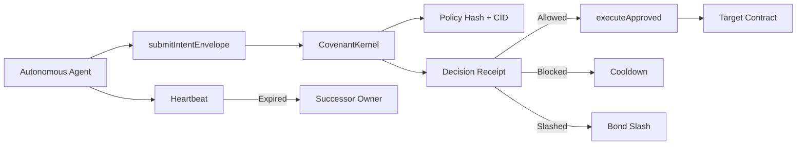

# Ritual Covenant

**A live on-chain policy firewall for autonomous agents on Ritual Chain Testnet.**

Ritual Covenant is not another dashboard that watches agents after the damage is done. It is a pre-execution control layer: an agent submits an intent, the kernel records a policy decision, bonded value is enforced, and approved execution becomes a public receipt.


## Live Proof

| Item | Value |
| --- | --- |
| Network | Ritual Chain Testnet |
| Chain ID | `1979` |
| Contract | [`0x4086710799f9d1Cb1eDb4D0a64522F00A5790270`](https://explorer.ritualfoundation.org/address/0x4086710799f9d1Cb1eDb4D0a64522F00A5790270) |
| Deployment tx | [`0xdd17daee2f10ec9489898b5ff3660cdfd11942223c2a167d99f404b09322cd30`](https://explorer.ritualfoundation.org/tx/0xdd17daee2f10ec9489898b5ff3660cdfd11942223c2a167d99f404b09322cd30) |
| Live execution tx | [`0xc2cfd5ee8d7e0106dd9a3067423731979e8f9c4b907b5f1e5a0762f1877e05fa`](https://explorer.ritualfoundation.org/tx/0xc2cfd5ee8d7e0106dd9a3067423731979e8f9c4b907b5f1e5a0762f1877e05fa) |
| Live agent | `agent #1` |
| Live check | `check #1` |
| Execution value | `0.005 RITUAL` |
| Remaining agent bond | `0.045 RITUAL` |

The frontend reads directly from Ritual RPC. It calls `agents(1)`, `intents(1)`, `receipts(1)`, transaction receipts, and `RitualValueSink.received()`. If RPC is unavailable, the UI shows an RPC state instead of falling back to fake data.

## What It Does

Ritual Covenant gives autonomous agents an enforceable operating boundary:

- **Agent registry:** binds an agent owner, successor, policy hash, policy CID, memory CID, heartbeat rule, and bonded value.
- **Intent firewall:** stores a proposed action before value, authority, or secrets move.
- **Decision receipts:** records `Allowed`, `Blocked`, `Slashed`, or inherited decisions as machine-readable hashes.
- **Bond enforcement:** approved execution debits only the registered agent's own bond.
- **Slashing path:** attestors can freeze and slash an agent that violates policy.
- **Machine inheritance:** missed heartbeat conditions can transfer control to a registered successor.
- **EIP-712 registration:** agents can sign policy registration off-chain through `registerAgentSigned`.

## Why This Is Different

Most agent safety tools are monitoring layers, chat-based judges, or post-incident review systems. Ritual Covenant is different because it sits before execution:

| Common approach | Limitation | Ritual Covenant |
| --- | --- | --- |
| Agent dashboard | Read-only telemetry | Contract-enforced decisions and receipts |
| AI judge | Subjective after-the-fact dispute | Pre-execution policy gate |
| Dead-man switch | Human estate recovery | Agent memory, bond, and successor recovery |
| Escrow task bot | Single-purpose payment flow | General agent policy kernel |

## Architecture



## Smart Contract

Main contract:

```text
contracts/CovenantKernel.sol
```

Core external surface:

```solidity
registerAgent(address agent, bytes32 policyHash, string cid, address successor)
submitIntent(uint256 agentId, bytes calldata intent, uint256 value)
submitIntentEnvelope(uint256 agentId, address target, uint256 value, bytes calldata callData, uint64 ttl)
recordDecision(uint256 checkId, uint8 decision, string reasonCid)
executeApproved(uint256 checkId, bytes calldata callData)
slash(uint256 agentId, uint256 amount, address beneficiary)
executeWill(uint256 agentId, string newMemoryCid)
registerAgentSigned(...)
```

Important implementation notes:

- Self-contained Solidity `0.8.24+`.
- No OpenZeppelin imports.
- Direct ETH transfers revert. Value enters through `registerAgent` or `fundAgent`.
- `executeApproved` requires an `Allowed` receipt and exact calldata hash match.
- A submitted intent can only execute once.
- Execution value is debited from that agent's bond, not from other agents.
- Ritual testnet millisecond-style timestamps are normalized inside the contract.

## Frontend

The app is a Vite + React + Three.js control surface. It uses live on-chain data for the dashboard, contract page, agent page, and receipt proof.

Key files:

```text
src/App.tsx
src/lib/onchain.ts
src/lib/contracts.ts
src/components/CovenantScene.tsx
```

Visual direction:

- Ritual-inspired hand-drawn science fiction layer.
- Live receipt console with explorer links.
- Agent state cards sourced from contract storage.
- Contract proof panel sourced from Ritual RPC.
- Responsive layout tested on desktop and mobile viewport sizes.

## Run Locally

Install and build:

```bash
npm install
npm run build
npm run serve
```

Open:

```text
http://127.0.0.1:5177/
```

For development:

```bash
npm run dev
```

## Verification

Compile the contract:

```bash
npm run contract:compile
```

Run local contract tests:

```bash
npm run contract:test
```

Estimate gas:

```bash
npm run contract:gas
```

Run the live Ritual flow:

```bash
npm run contract:live
```

Build the frontend:

```bash
npm run build
```

Current verification status:

- Contract compile: pass
- Contract tests: pass
- Gas estimate: pass
- Live Ritual flow: pass
- Frontend build: pass
- Browser console QA: zero errors
- Ritual RPC reads: HTTP `200`
- Live execution receipt: success

## Vercel Deploy

Import this repository into Vercel and use:

| Setting | Value |
| --- | --- |
| Framework | Vite |
| Build command | `npm run build` |
| Output directory | `dist` |
| Environment variables | none required for frontend |

The frontend uses public Ritual RPC and public contract addresses. No private key is needed for the deployed website.

## Security Notes

- Do not commit `.env` or `.env.wallets`.
- The repository includes `.env.example` only.
- Use burner wallets for deployment and live testing.
- The live deployed contract is testnet software and not a third-party audited production vault.
- Private keys are never required by the frontend.

## Project Structure

```text
contracts/
  CovenantKernel.sol          Solidity policy kernel
  README.md                   Contract handoff details

src/
  App.tsx                     Main multi-page interface
  lib/onchain.ts              Ritual RPC reader
  lib/contracts.ts            Live addresses and proof txs
  components/CovenantScene.tsx

scripts/
  contract-tests.cjs          Local contract test suite
  deploy-ritual.cjs           Ritual testnet deploy script
  live-ritual-flow.cjs        Live on-chain smoke flow
  contract-gas-estimate.cjs   Gas estimates

public/ritual/
  Generated Ritual-style visual assets
```

## Submission Summary

Ritual Covenant demonstrates a concrete primitive for agent safety on Ritual:

1. Register an autonomous agent with policy, successor, heartbeat, and bond.
2. Submit an executable intent before value moves.
3. Record a policy decision as an on-chain receipt.
4. Execute only if the receipt is `Allowed`.
5. Keep a public trail through explorer links and frontend RPC reads.

This is the core pitch: **a policy firewall for autonomous agents, not a passive dashboard.**
